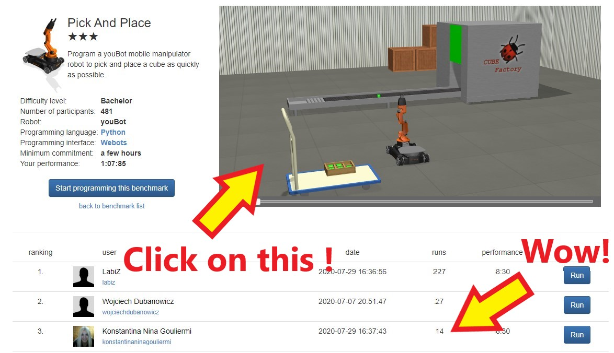

A project activity for [Girls Into Coding](https://www.girlsintocoding.com/) using a online version of the free open source [Webots](https://www.cyberbotics.com/) robot simulator.

This session is designed to be fun! The idea is that we can follow it together online, but that we can be free to move at our own pace.

<h2>Contents</h2>
<ul class="list-group">
  <li class="list-group-item">Resources</li>
  <li class="list-group-item">What is a robot simulator?</li>
  <li class="list-group-item">Why simulate robots?</li>
  <li class="list-group-item">First steps using the robot simulator</li>
  <li class="list-group-item">Making a robot move</li>
</ul>

<h2>Resources</h2>
<ul class="list-group">
  <a href="https://www.pythoncheatsheet.org/" class="list-group-item list-group-item-action">Python cheatsheet</a>
  <a href="https://www.cyberbotics.com/doc/reference/index" class="list-group-item list-group-item-action">Webots documentation</a>
</ul>

<!--Comment: Paragrpah spacing-->
 
 

# What is a robot simulator?
---
A robot simulator is like a video game, with robots in it! It's a very realistic version of the world, with one or more virtual robots inside. Let's try it out !! 

<h2>Activity #1</h2>

We're going to be using [robotbenchmark](https://robotbenchmark.net/) in this activity, which is a online version of the 'Webots' simulator. 

* Navigate there in your browser now, by clicking this [link](https://robotbenchmark.net/).
* Click on the start button next to the pick and place activity.
* You will see a simulation running already, in the top right hand corner of the screen, try clicking on it to change the view.

<b>Left click:</b> rotate   <b>Right click:</b> move

You can click on any of the 'run' buttons to see someone else's attempt at coding the robot. 
* Try clicking on the run button next to Konstantina's record.
* Click on the 'play' button in the bottom left hand corner

<!--Comment: Paragrpah spacing-->
 
 

# Why simulate robots?
---

Why would we want to simulate robots? .... Well because it's helpful for designing them. Let's take a look at this video.

In the video you can see robotics professor Sabine Hauert talking about swarms of flying robots. The robots are tested in simulation!. If something is wrong with the software, and the robots crash it doesn't break the real robot! They can just change the software and restart the simulation until they get it right! Then they can try it on the real swarm of robots!

<svg class="bi" width="32" height="32" fill="currentColor">
  <use xlink:href="bootstrap-icons.svg#heart-fill"/>
</svg>

<h2>Poll!</h2>
<b>Question</b> If you become a robot designer in the future, what kind of robots would you prefer to build?

<!--Comment: Start of markdown poll-->

<!--Comment: End of markdown poll-->

<!--Comment: Paragrpah spacing-->
 
 

# First steps using the robot simulator
---

<h2>Activity #2</h2>

* Let's return to the [robotbenchmark](https://robotbenchmark.net/) website.
* Click on the **Start** button next to the **Viewpoint Control** activity
* Click on **Start programming this benchmark**
*

<h2>Activity #3</h2>

---

